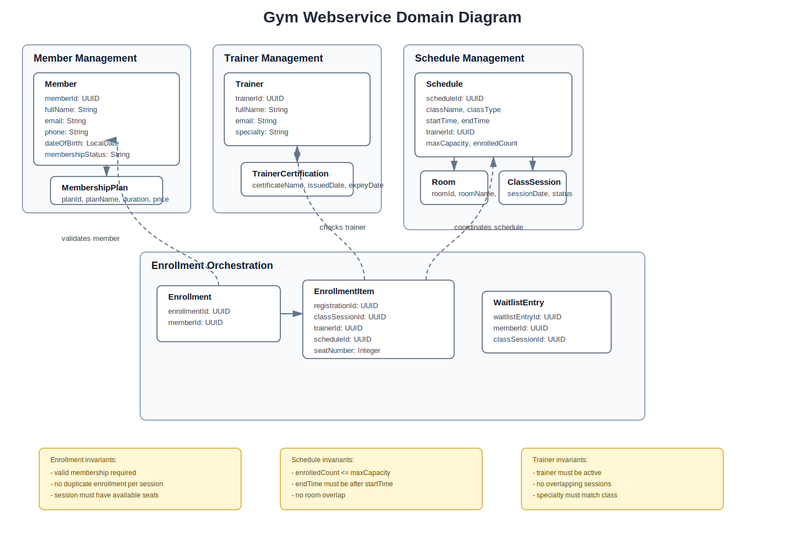

# Gym Webservice Final Project

Spring Boot web service for gym member management, trainer management, schedule management, and membership/class enrollment orchestration.

## Team

- Andre Lamontagne
- Nathan Bessette

## Project Scope

This project implements four modular subdomains:

- `member`: member management
- `trainer`: trainer management
- `schedule`: class schedule management
- `enrollment`: orchestration for member class enrollment

Each module follows a layered package structure:

- `api`
- `application`
- `domain`
- `infrastructure`

## Tech Stack

- Java 17
- Spring Boot
- Spring Web MVC
- Spring Data JPA
- Flyway
- PostgreSQL
- H2
- Springdoc OpenAPI / Swagger UI
- Spring HATEOAS
- Docker / Docker Compose
- Gradle

## Repository Contents

This repository includes:

- complete source code in `src`
- `README.md`
- `Dockerfile`
- `docker-compose.yml`
- Flyway migration files in `src/main/resources/db/migration`
- PlantUML source file `docs/domain-diagram.puml`
- rendered domain diagram `docs/domain-diagram.svg`
- Postman collection `postman/gym_webservice.postman_collection.json`

## How To Run

### Option 1: Docker

1. Start Docker Desktop.
2. From the project root, run:

```powershell
docker compose down -v
docker compose up -d --build
```

3. Verify containers:

```powershell
docker compose ps
```

4. Open Swagger UI:

- [http://localhost:8081/swagger-ui.html](http://localhost:8081/swagger-ui.html)

### Option 2: Local Gradle Run

1. Run the application:

```powershell
.\gradlew.bat bootRun
```

2. Open Swagger UI:

- [http://localhost:8080/swagger-ui.html](http://localhost:8080/swagger-ui.html)

## Database Configuration

### Docker PostgreSQL

- Host: `localhost`
- Port: `5433`
- Database: `gym_db`
- Username: `gym`
- Password: `gym`

### Local Default Profile

The default profile is `h2`, so local startup works without Docker unless `pg` is explicitly selected.

## API Testing

### Swagger

Swagger UI is available at:

- Docker: [http://localhost:8081/swagger-ui.html](http://localhost:8081/swagger-ui.html)
- Local: [http://localhost:8080/swagger-ui.html](http://localhost:8080/swagger-ui.html)

### Postman

Import:

- `postman/gym_webservice.postman_collection.json`

The collection covers:

- member CRUD
- trainer CRUD
- schedule CRUD
- enrollment orchestration
- validation failures
- business conflict errors
- HATEOAS checks

## Running Tests

Run automated tests with:

```powershell
.\gradlew.bat test
```

Build the application jar with:

```powershell
.\gradlew.bat bootJar
```

## Project Structure

```text
src
  main
    java/com/andre_nathan/gym_webservice
      modules
        member
        trainer
        schedule
        enrollment
      shared
    resources
      db/migration
  test
    java/com/andre_nathan/gym_webservice
docs
postman
```

## Demo Checklist

For the Phase 2 demo, show:

- application running successfully
- Docker containers running
- Swagger loading
- CRUD operations on all four modules
- one orchestration request using the supporting subdomains
- HATEOAS links on enrollment responses
- database changes visible in PostgreSQL / pgAdmin
- one validation error
- one business-rule conflict error

## Domain Diagram

PlantUML source:

- `docs/domain-diagram.puml`

Rendered diagram:


